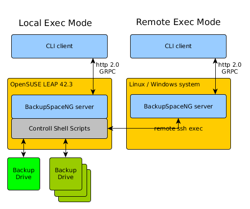
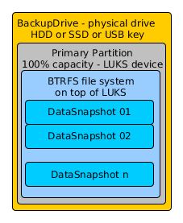

Backup Space NG
===============
System for keeping consistent and secure home backups. 
Work in progress ...

Architecture
------------


__Components__
* BackupSpaceNG server - command line client.
* BackupSpaceNG CLI - service layer for consistent client access.
* [Control Scripts](scripts/README.md) - control scripts for managing backup drives.

Backup Drive
------------


Build all projects
------------------
```gradle clean install distZip```

#### Run BackupSpaceNG server
After the project has been build, use commands below to start server.
```
cd backup-ng-server/build/install/backup-ng-server/bin
./backup-ng-server
```
Default configuration file is ```backup-ng-server/build/install/backup-ng-server/config/configuration.json``` directory.
Zipped distribution is in ```backup-ng-server/build/distributions/backup-ng-server-1.0.0-SNAPSHOT.zip```

#### Run CLI client
After the project has been build, use commands below to start command line client.
```
cd backup-ng-cli/build/install/backup-ng-cli/bin
./backup-ng-cli
```

#### Deploy control shell scripts
This is how control scripts are deployed on target system.
```
sshpass -p secret ssh root@192.168.30.21 rm -rf /opt/backupng/scripts
sshpass -p secret scp -r scripts root@192.168.30.21:/opt/backupng/
```
