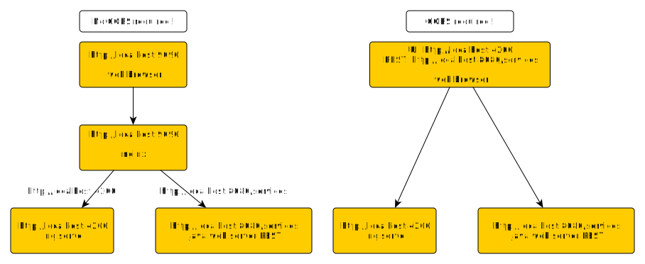

# Using NGINX with Angular and Spring 

This simple setup shows how to run Angular UI and java web backend.
NGINX is runnig as reverse proxy in this case.

## Setup
Instead of enabling CORS on the browser, nginx is used as reverse proxy. 
- web browser is talking to single server without knowing that UI and REST services are running on separate servers.
- CORS is not necessary
- nginx configuration is [here](default) 
- nginx is routing http traffic to angular UI and/or REST server

## Install nginx
[nginx](https://www.nginx.com/) installation (for ubuntu linux 18.04 LTS)
``
sudo apt install nginx
sudo systemctl start nginx 
sudo systemctl stop nginx 
sudo systemctl restart nginx
``
config: ``/etc/nginx/sites-enabled/default``

