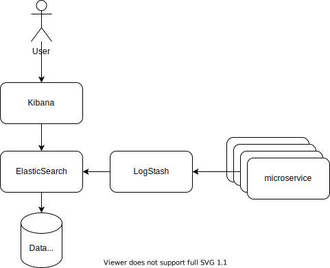

# ELK stack



```
docker-compose up -d
docker-compose down -v --rmi all --remove-orphans
```

### Elastic Search

```
mkdir /opt/data/elasticsearch-data
chown -R user:group /opt/data/elasticsearch-data
docker run -d --name elasticsearch \
  --restart unless-stopped \
  -p 9200:9200 -p 9300:9300 \
  -e "discovery.type=single-node" \
  -v "/opt/data/elasticsearch-data:/usr/share/elasticsearch/data" \
  elasticsearch:7.13.3
docker logs -f elasticsearch
docker stop elasticsearch
docker rm elasticsearch
```
```
curl http://localhost:9200/_cluster/health
curl http://localhost:9200/_cat/master
curl http://localhost:9200/_cat/indices
```

### Log Stash
```
docker run -d --name logstash \
  --restart unless-stopped \
  -p 5044:5044 \
  -e "monitoring.elasticsearch.hosts=http://localhost:9200" \
  -e "xpack.monitoring.enabled=false" \
  -v "/opt/data/logstash-data/logstash.conf:/usr/share/logstash/config/logstash.conf" \
  docker.elastic.co/logstash/logstash:7.13.3
```

### Kibana
```
docker run -d --name kibana \
  --restart unless-stopped \
  -p 5601:5601 \
  -e "ELASTICSEARCH_HOSTS=http://localhost:9200" \
  docker.elastic.co/kibana/kibana:7.13.3
docker logs -f kibana
docker stop kibana
docker rm kibana
```
http://localhost:5601/
