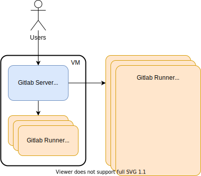

# Gitlab in docker



1. Start gitlab stack (Gitlab server + runner(s))
````
docker stack deploy -c gitlab-docker-swarm.yml gitlab 
docker stack services gitlab
docker service ps --no-trunc gitlab_gitlab
docker service ps --no-trunc gitlab_gitlab-runner
````
2. Use gitlab stack
``http://<server-ip>`` root : topsecret
3. Check volumes in use
```
docker volume ls
docker volume inspect <volume>
``` 

## Setup Runner in Docker
Gitlab runner in docker is started as part of gitlab stack. Check [gitlab-docker-swarm.yml](gitlab-docker-swarm.yml)

## Install and Setup Runner on VM
1. Make sure the docker is installed.  
2. Install gitlab runner.
```
sudo yum update -y
sudo yum install -y git
curl -LJO "https://gitlab-runner-downloads.s3.amazonaws.com/v14.3.2/rpm/gitlab-runner_amd64.rpm"
rpm -i gitlab-runner_amd64.rpm
rpm -e gitlab-runner
```
3. Add gitlab-runner user into docker group.

## Register Gitlab Runner
This step is common for dockerized runner or VM runner. 
Login into VM or inside dockerized runner and follow those instructions:
1. Stop Gitlab runner
```
gitlab-runner stop
``` 
3. Register gitlab runner
```
gitlab-runner register \
 --non-interactive \
 --url http://192.168.122.81/ \
 --registration-token __THE-TOKEN__ \
 --name docker-runner \
 --tag-list "docker" \
 --executor docker \
 --docker-privileged \
 --locked="false" \
 --run-untagged \
 --docker-volumes="/var/run/docker.sock:/var/run/docker.sock" \
 --docker-image docker:stable
``` 
3. Check content of ``/etc/gitlab-runner/config.toml``
4. Start Gitlab runner
```
gitlab-runner start
``` 

### References
* [GitLab Docker Examples](https://github.com/docker-envs/gitlab)
* [GitLab Docker](https://docs.gitlab.com/ee/install/docker.html)
* [Gitlab Swarm](https://docs.gitlab.com/ee/install/docker.html#install-gitlab-using-docker-swarm-mode)
