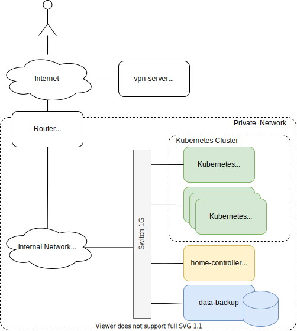

# Small/Home Data Center

This is project of small (potentially portable) data center.
Main goals of this project: 
* kubernetes practicing.
* distributed systems / clustering testing.
* home IoT, harwdare control.
* low power design 25W idle. 

## Hardware Architecture

The internal network: CIDR=192.168.44.0/24

| HW Component    | CPU              | RAM       | Disk                   | Power |
|-----------------|------------------|-----------|------------------------|-------|
| rpi-controller  | PRi4          4x | 8G LPDDR4 | 32G micro SD           |  5V   |
| rpi-workers(s)  | PRi4          4x | 8G LPDDR4 | 32G micro SD           |  5V   |
| home-controller | Celeron N3160 4x | 8G DDR3   | INTEL SSDSC2CT120A3    | 12V   |
|                 |                  |           | WDC WDS120G2G0A-00JH30 |       |
| data-backup     | Celeron J1900 4x | 8G DDR3   | KINGSTON SV300S37A60G  | 12V   |
|                 |                  |           | WDC WD10JFCX-68N6GN0   |       |
|                 |                  |           | WDC WD10JFCX-68N6GN0   |       |

| HW Component        | Description     | Power   |
|---------------------|-----------------|---------|
| 1G Ethernet Switch  | TP-Link         |  12V    |
| [Power Supply](docs/power-supply.md)        | AC-DC converter |  ~230V -> DC 5, 12V |

### Public OpenVPN-Server

### Router

### Kubernetes Cluster

### Home-Controller

### Data-Backup

