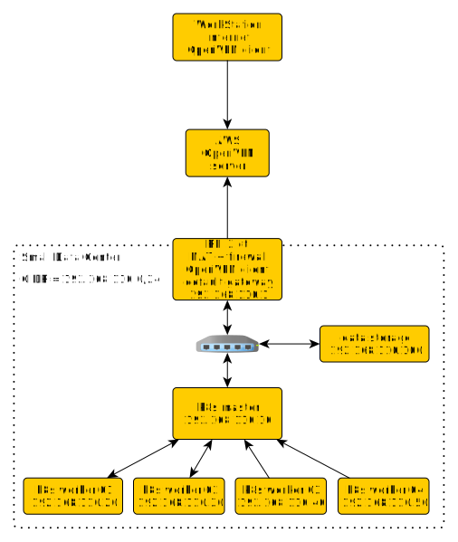

# Small DC

This is project of small (potentially portable) data center.
Main goals of this project: 
* kubernetes practicing.
* distributed systems / clustering testing.
* microservice playground.
* networking playground.

## DC gateway

## Public OpenVPN server

## Accessing DC

