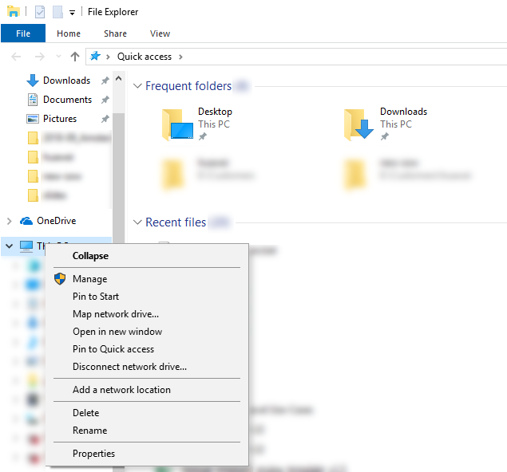
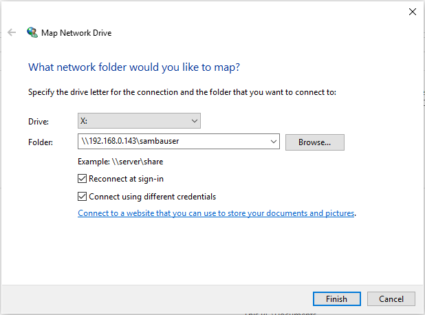
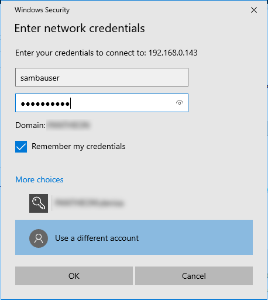
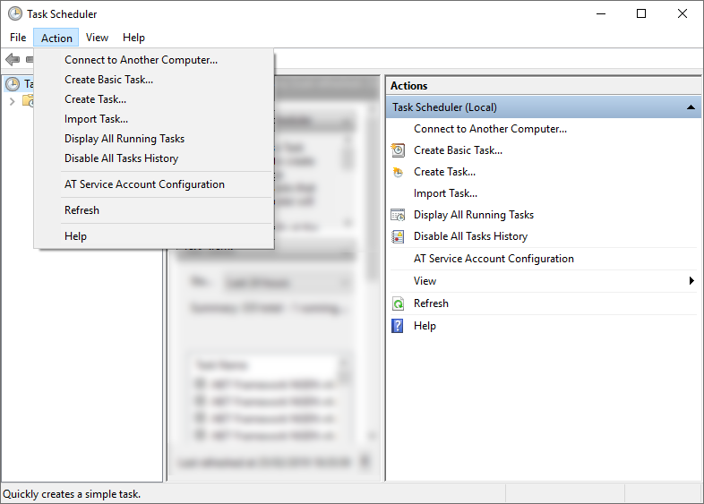
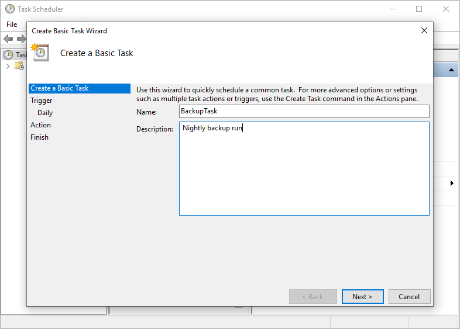
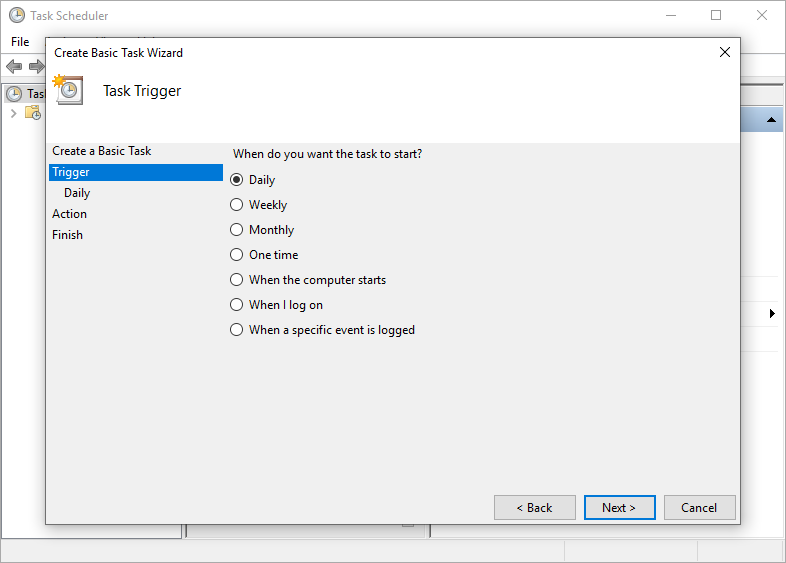
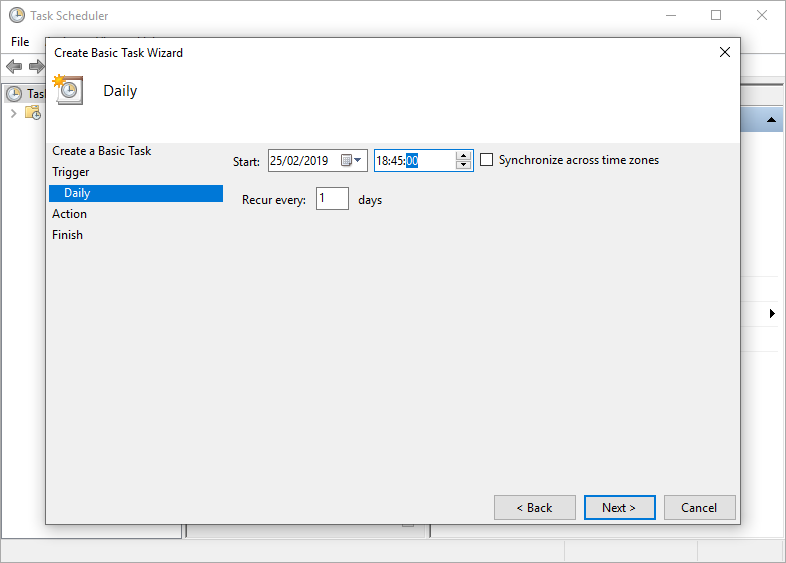
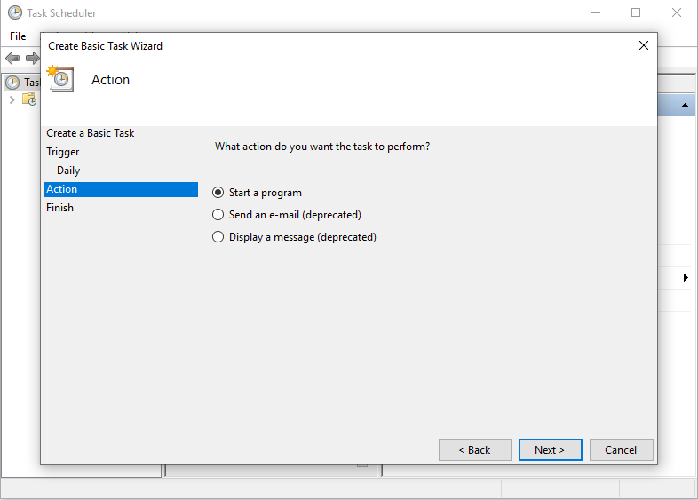
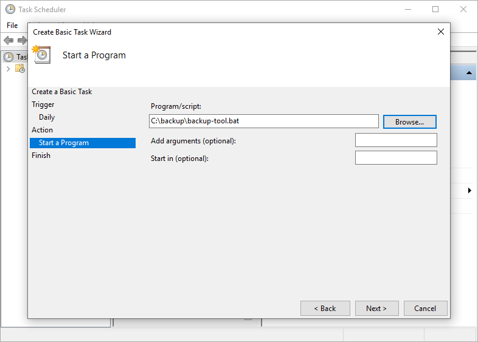
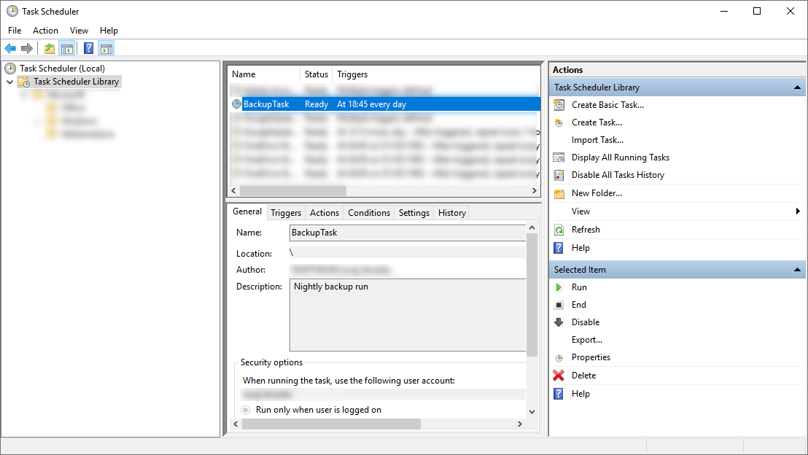

# Ubuntu 18.04 LTS as Windows backup server
This is small office setup for data backup from client PCs to centralized backup server.
Clients: any PC/workstation (Linux, Windows)

## Ubuntu 18.04 LTS backup server setup
As backup server / NAS, (Ubuntu 18.04 LTS x64 server)[https://www.ubuntu.com/download/server] is used. Server has 4 hard drives attached.
1. 32BG SSD drive for operating system 
2. 3x WD 750G magnetic drive for data with redundancy (mirroring)

### S.M.A.R.T
Install smartmontools 
``apt install smartmontools``

``
smartctl --smart=on /dev/sdb
smartctl --smart=on /dev/sdc
smartctl --smart=on /dev/sdd
``

``
smartctl -H /dev/sdb
smartctl -H /dev/sdc
smartctl -H /dev/sdd
``

### ZFS setup
1. Install ZFS 
   ``sudo apt-get install zfsutils-linux``
2. To create a mirrored pool, we run
   ``sudo zpool create -m /opt/backup-data backup-pool mirror /dev/sdb /dev/sdc /dev/sdd`` 
3. list active ZFS pools
   ``sudo zpool list``
4. backup pool checks and diagnostics
   ``
   sudo zpool status
   sudo zpool scrub backup-pool 
   `` 

### Samba setup
1. Install samba
   ``sudo apt-get install samba samba-common``
2. Setup samba config
   ``sudo mv /etc/samba/smb.conf /etc/samba/smb.conf-backup``
   Content of new configuration:
   ``
   [global]
   workgroup = WORKGROUP
   server string = Samba Server %v
   netbios name = ubuntu1804
   security = user
   map to guest = bad user
   name resolve order = bcast host
   dns proxy = no
   bind interfaces only = yes

   [Public]
   path = /opt/backup-data/samba/public
   writable = yes
   guest ok = yes
   guest only = yes
   read only = no
   create mode = 0777
   directory mode = 0777
   force user = nobody
   ``
3. For each windows client, add samba user and configuration.
   ``
   sudo adduser --no-create-home --disabled-password --disabled-login sambausername
   sudo smbpasswd -a sambausername
   `` 
   Configuration:
   ``
   [sambausername]
     comment = whatever
     path = /opt/backup-data/samba/sambausername to share
     browsable = yes
     read only = no
     guest ok = no
     valid users = sambausername
     create mode = 0777
     directory mode = 0777

   ``
   Setup file system:
   ``
   mkdir -p /opt/backup-data/samba/sambausername
   chown sambausername:sambausername /opt/backup-data/samba/sambausername
   ``
4. Restart samba server and reload configuration
   ``
   sudo service smbd status
   sudo service smbd stop
   sudo service smbd start 
   `` 

### Backup server diagnostic and cleanup
1. Setup periodic ZFS scrub and S.M.A.R.T. monitoring
   TODO: finish setup
2. Setup deleting of old backups
   TODO: finish setup

## Client setup

### Windows 10 client setup
For convenience, backup on windows clients is scheduled at night, so users do not interfere.
Client PCs are automatically turned on at night, backup is done as scheduled task and PCs are shutdown when backup si done.
1. Install [7zip](https://www.7-zip.org/download.html)
2. Permanently mount user's samba drive as X: drive
   
   
   
3. Schedule PC to turn itself on at night (bios setup or wake on LAN)
4. Schedule local backup script [backup-tool.bat](backup-tool.bat) to run periodically "create a basic task"
   
   
   
   
   
   
   
5. backup tooling is installed in ``c:\backup`` directory

